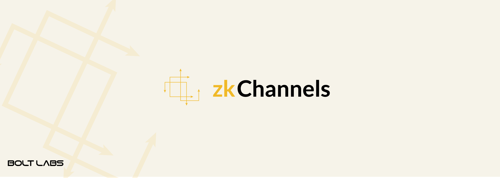

## zkLND

###### Disclaimer: zkLND is in a proof of concept stage and we are actively improving it and adding features. If you encounter any issues, please post them in GitHub issues. Thanks!

zkLND is a complete implementation of a [zkChannels](https://github.com/boltlabs-inc/libzkchannels) node, forked from the [`lnd`](https://github.com/lightningnetwork/lnd) implementation of the Lightning Network. zkLND interacts with the bitcoin blockchain via a [`btcd`](https://github.com/btcsuite/btcd) node.
The project's codebase also uses the [btcsuite](https://github.com/btcsuite/) set of Bitcoin libraries, and also exports a large set of isolated re-usable Lightning Network related libraries within it.  In the current state zkLND is capable of:
* Creating channels.
* Sending unlinkable payments.
* Closing channels.

## Developer Resources
The daemon has been designed to be as developer friendly as possible in order
to facilitate application development on top of `lnd`. Two primary RPC
interfaces are exported: an HTTP REST API, and a [gRPC](https://grpc.io/)
service. The exported API's are not yet stable, so be warned: they may change
drastically in the near future.

An automatically generated set of documentation for the RPC APIs can be found
at [api.lightning.community](https://api.lightning.community). A set of developer
resources including talks, articles, and example applications can be found at:
[dev.lightning.community](https://dev.lightning.community).

## Installation
In order to build from source, please see [the installation instructions](zklnd_tutorial/zklnd_installation_instructions.md).

## Safety
It is important to note that zkLND is still **beta** software and that you should not attempt to run it on mainnet. The tutorial provides instructions for how to run zkLND with btcd running in simnet (a local simulation) mode.

## Further reading
* [zkChannels blog post](https://medium.com/boltlabs/zkchannels-for-bitcoin-f1bbf6e3570e)
* [zkchannels overview](zklnd_tutorial/zklnd_overview.md)
