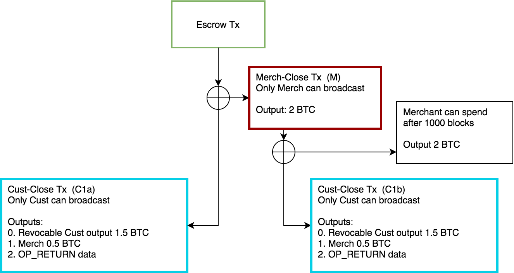
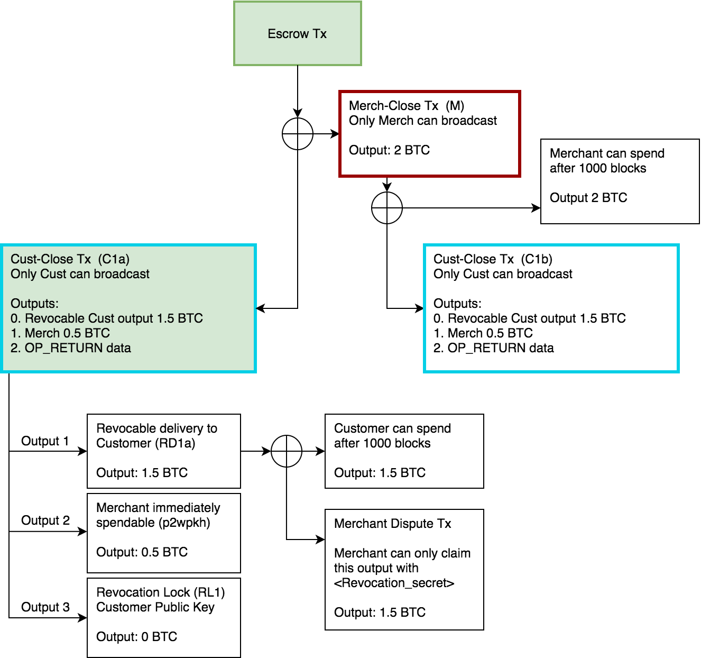
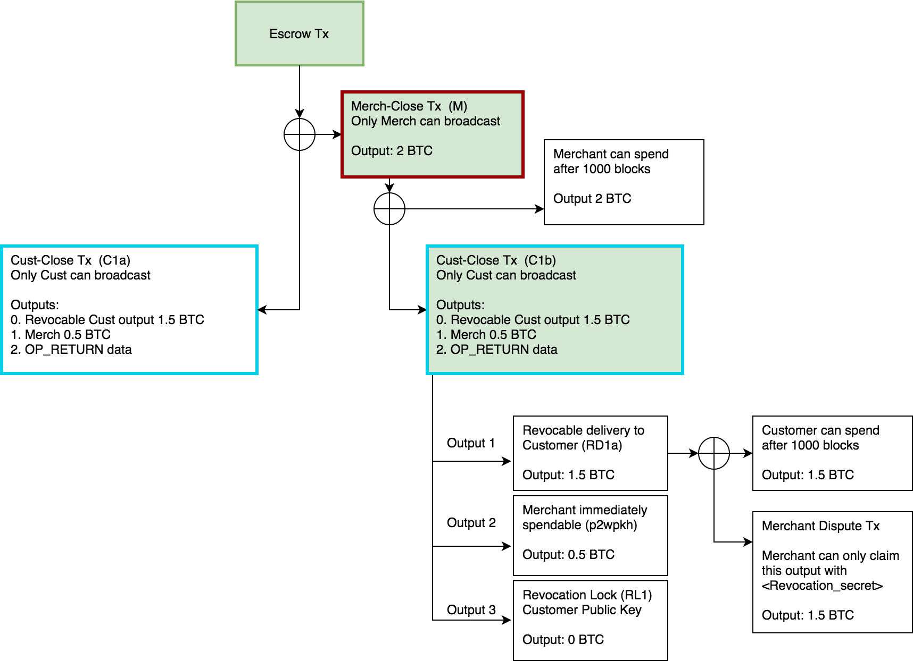
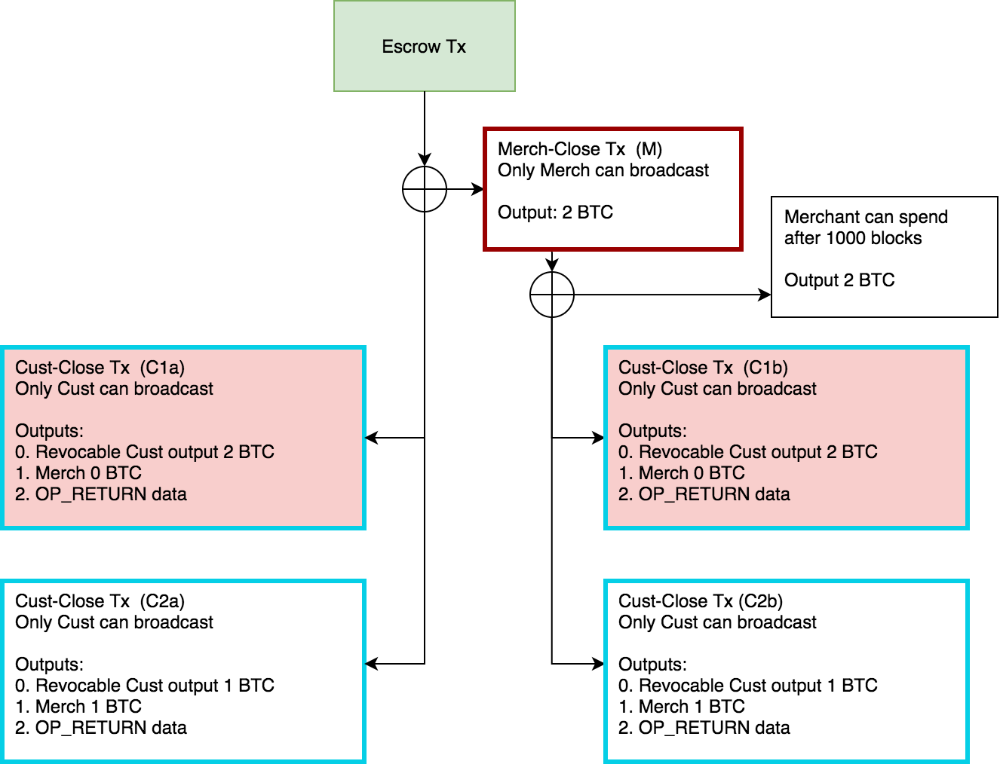

# Bitcoin zkChannels Overview

After reading this overview, you can try creating your own zkChannels by following the [zkLND installation guide](zklnd_installation_instructions.md) and following the [zkLND tutorial!](zklnd_tutorial.md)

## Introduction
This overview aims to provide a description of the transaction paths and Bitcoin scripts used in the zkChannels protocol. zkChannels, originally named the BOLT protocol, was inspired by the Lightning Network (LN) and therefore features many of the same characteristics, namely, multisig outputs, revocable outputs with relative timelocks, with penalty transactions.

The main difference between zkChannels and LN payment channels is that zkChannels are asymmetric. zkChannels consist of a 'Customer' and a 'Merchant'. Only the Customer knows the channel balance and is able to initiate payments and close the channel. In comparison, the Merchant is only able to accept payments and close the channel. Also, since payments are limited to within the channel, they do not rely on HTLCs. 

### Channel Establishment

The escrow transaction in zkChannels is just like the funding transaction in LN payment channels, a 2 of 2 multisig with both node's pubkeys.

    # Escrow Tx Script:
    OP_2
    <Merch_Pubkey>
    <Cust_Pubkey>
    OP_2
    OP_CHECKMULTISIG

Just like with LN payment channels, before the escrow tx can be broadcast, both parties need signed transactions that would allow them to close the channel unilaterally. These are cust-close-txs (C1a and C1b) and merch-close-tx (M) (Figure 1).

In the example diagram below, the initial balances of the channel are the Customer has 1.5 btc and the Merchant has 0.5 btc. The maroon border indicates that only the Merchant holds that signed transaction, and the cyan indicates that only the Customer holds that signed transaction.

Note that in this initial version 1 of zkChannels we are not considering transaction fees. However, the overall flow of transactions and scripts outlined here would remain the same.

###### Figure 1: Initial Cust-Close and Merch-Close Transactions

### Close Transactions

When the Customer and Merchant have received their respective close transactions, the escrow transaction is broadcasted. First, we will cover the case where the customer initiates channel closure directly from the escrow transaction, labelled C1a. Green shading represents transcations which have been broadcast to the blockchain.

###### Figure 2: Cust-Close Tx (C1a) from Escrow

Cust-Close Tx has three outputs. The first output holds the Customer's balance and is locked with the following script:

    # Revocable Delivery to Customer Tx  (RD1a) Script:
    OP_IF
        OP_SHA256
        <Revocation_lock>
        OP_EQUALVERIFY
        <Merch-Pubkey>
    OP_ELSE
        <to_self_delay>
        OP_CHECKSEQUENCEVERIFY
        OP_DROP
        <Cust-Pubkey2>
    OP_ENDIF
    OP_CHECKSIG

 The Customer may claim this output once the relative timelock has passed, e.g. 1000 blocks. However, if the Merchant knows the `revocation secret`, which is it SHA256 preimage of the `revocation lock`, they will be able to claim it immediately. This revocation mechanism will be used later when the Customer makes their first payment.

The second output is a standard Pay to Witness Pubkey Hash (P2WPKH) output, paying the Merchant's balance to `Merch-Pubkey`, and may be claimed immediately.

The third output contains data in an `OP_RETURN` script.

    # OP_RETURN Data Script:
    OP_RETURN
    <Revocation_lock>
    <Cust-Pubkey2>

 The two fields stored here are used for the Merchant to be able to recreate the script needed to claim the first output. Therefore, the `revocation lock` and `Cust-Pubkey2` must be identical to the ones in the script of the first output.

Now, we will cover what happens when the Merchant initiates channel closure.

 ###### Figure 3: Cust-Close Tx (C1b) from Merch-Close Tx

Conceptually, what the Merch-Close Tx allows the Merchant to do is to force the Customer to broadcast their latest close transaction.

Merch-Close Tx has just one output for the total channel amount, locked by the following script:

    # Merch-close-tx (M):
    OP_IF
        OP_2
        <Merch-Pubkey>
        <Cust-Pubkey>
        OP_2
        OP_CHECKMULTISIG
    OP_ELSE
        <to_self_delay>
        OP_CHECKSEQUENCEVERIFY
        OP_DROP
        <Merch-Pubkey2>
    OP_CHECKSIG
    OP_ENDIF

If no action is taken, the Merchant will be able to spend from this transaction after the relative timelock, e.g. 1000 blocks. This effectively forces the Customer to instead spend from this output by broadcasting their other version of Cust-Close Tx, C1b. The locking script for C1b is exactly the same as C1a, and it is only their inputs which differ, either the escrow transaction or Merch-Close Tx.

### Payments

A payment on a zkChannel involves two steps, the Customer obtaining the Merchant's signatures on new Cust-Close Txs (C2a and C2b) reflecting the new balance, and the Customer revoking the previous Cust-Close Txs (C1a and C1b). Obtaining the new Merchant's signatures happens during the multiparty computation (MPC) pay protocol. This guarantees to the Merchant that the payment is valid, without revealing any identifying information linking the payment to the zkChannel.

###### Figure 4: Payments - Revoking old close transactions

In this example, the Customer made a payment of 0.5 btc to the Merchant. The Merchant will have the `revocation secret` for the previous Cust-Close Txs (the same secret is used for both), allowing them to claim the full balance, should the Customer broadcast a revoked close transaction.

Note that the Merchant still only has the original close transaction created when the channel was established. This provides the Merchant the ability to unilaterally close the channel without gaining knowledge of the latest balances.

### FAQ

###### Aren't Lightning Network payment channels already private?
Generally, second layer solutions such as LN and zkChannels are more private than on-chain transactions in that they are not recorded on the public blockchain.

While there is no privacy within a LN payment channel, multihop LN payments use onion routing, obscuring the source and destination of a payment. Although it is possible for intermediary nodes to collude to deanonymize LN payments, this can be made harder by having a well connected node, and using techniques such as Atomic Multipath Payments.

What zkChannels offer is privacy with respect to the Merchant they have formed a payment channel with. The Merchant will only know the channel capacity and the opening and closing of transactions. However, the Merchant would not be able to link a payment to a specific channel. It will only know that a Customer who has an open channel made a valid payment.

###### Are zkChannels compatible with the Lightning Network?
The current zkChannels version 1 only supports direct payments within a channel and as such, is not compatible with the Lighting Network. In the next version we will have an intermediary solution supporting private one-hop payments with the Merchant as the intermediary.

An on-going area of research is a LN compatible solution for multihop payments, with zkChannels used for the first and last channels, and HTLC routing in the intermediary nodes.
